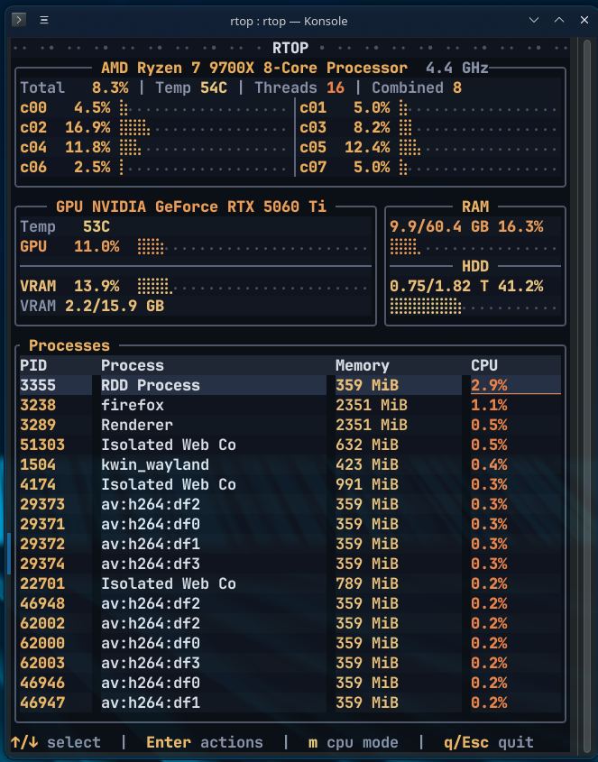

# rtop

`rtop` is a terminal system monitor built with Rust and `ratatui`.  
It provides a compact, real-time view of CPU, GPU, memory, disk, and top processes with ability to kill processes.

## Hardware Support

- CPU: vendor-neutral via `sysinfo` (works on Intel and AMD CPUs).
- GPU:
  - NVIDIA via `nvidia-smi`.
  - AMD via Linux `amdgpu` sysfs metrics under `/sys/class/drm`.



## Clone

```bash
git clone https://github.com/thongraegu/rtop.git
cd rtop
```

## Install

```bash
cargo install --path .
```

## Run

```bash
rtop
```

## Run Without Installing

```bash
cargo run --release
```
